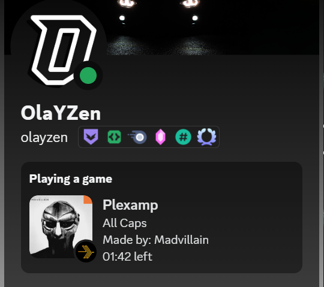

# Plex-discord
Shows your current playing song on Plexamp on discord. Just like the official Spotify Rich Presence



Before you start you need a NGINX reverse proxy. Look up yourself how to setup.

# Features
- Self Hosted album covers
- Multiple Language Support
- Customizable Log file
- Adjustable Album Size
- Storing ID's of Albums

It currently only works if you are using Plexamp. Not browsers

# Install
Git clone the repo

```
git clone https://github.com/OlaYZen/plex-discord
```
and change directory ( `cd` ) to it.

Download the requirements

```
 pip install -r requirements.txt
```
change the config.ini settings and 

start the program
```
python main.py
```


# Config.ini
```ini
[Plex]
PLEX_URL = http://x.x.x.x:32400/
PLEX_TOKEN = YOUR PLEX TOKEN
SPECIFIC_USERNAME = YOUR PLEX USERNAME

[Discord]
DISCORD_CLIENT_ID = YOUR DISCORD CLIENT ID

[Settings]
ALBUM_COVER_SIZE = 300
ALBUM_COVER_URL = https://your.domain.com/album_cover
ALBUM_COVER_URL_LENGTH = 32
; Check NGINX config in README

[Logging]
LOG_FILE = plex-discord.log
LOG_LEVEL = ERROR

[Language]
LANGUAGE = en
```
### [Plex]
Add your plex url, username and find your [plex token](https://support.plex.tv/articles/204059436-finding-an-authentication-token-x-plex-token/)

### [Discord]
Add your Discord client id from your [Discord Application](https://discord.com/developers/applications)

### [Settings]
Add your reverse proxy url in the settings. If you want you can change the lenght of the random numbers generated for ALBUM_COVER_URL_LENGTH. The values will be in album_cover_ids.json
If you do not want a reverse proxy, you can setup a free image uploader service and rewrite the code to work with that. Examples are imgur.

### [Logging]
Here you can change the name of the log file and what type you want to log.

### [Language]
Here you can change the language of the Discord Rich Preferance. You can easily add more languages to `translations.ini`

# NGINX:
### Default
Add this site to your `Default` config.

```conf
server {
    listen 80;
    server_name your.domain.com;
    location / {
        proxy_pass http://x.x.x.x:8081;
        proxy_set_header Host $host;
        proxy_set_header X-Real-IP $remote_addr;
        proxy_set_header X-Forwarded-For $proxy_add_x_forwarded_for;
        proxy_set_header X-Forwarded-Proto $scheme;
        proxy_set_header Upgrade $http_upgrade;
        proxy_set_header Connection "upgrade";
    }
}
```

### nginx.conf
Add this map to your `http` settings.

```conf
http {
    map $http_upgrade $connection_upgrade {
        default upgrade;
        '' close;
    }
}
```
