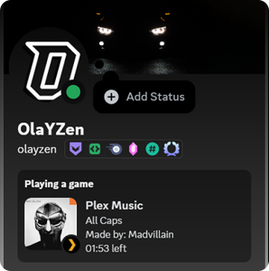
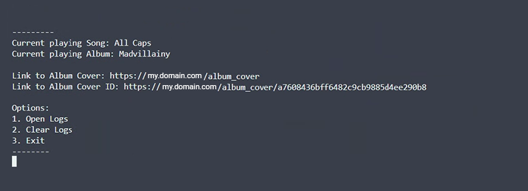

# Plexamp-rp
Shows your current playing song on Plexamp and Plex on Discord. Just like the official Spotify Rich Presence
<p align="center">
  
</p>
<p align="center">
  <sup>Screenshots from Plex and Plexamp</sup>  
</p>


### Before you start you need a NGINX reverse proxy. Look up yourself how to setup.

# Features
- Self Hosted album covers
- Multiple Language Support
- Customizable Log file
- Adjustable Album Size
- Storing ID's of Albums
- Prioritizing the Music player
- GUI version of the script

It currently only works if you are using Plexamp. Not browsers

# Install
Git clone the repo

```
git clone https://github.com/OlaYZen/plexamp-rp
```
and change directory ( `cd` ) to it.

Download the requirements

```
pip install -r requirements.txt
```
change the config.ini settings and 

start the program
```
python main.py
```
---

# Config.ini
```ini
[Plex]
PLEX_URL = http://x.x.x.x:32400/
PLEX_TOKEN = YOUR PLEX TOKEN
SPECIFIC_USERNAME = YOUR PLEX USERNAME

[Discord]
DISCORD_CLIENT_ID = YOUR DISCORD CLIENT ID

[Settings]
ALBUM_COVER_SIZE = 300
ALBUM_COVER_URL = https://your.domain.com/album_cover
ALBUM_COVER_URL_LENGTH = 32
PLATFORM_PRIORITY = Plexamp, Web

[Logging]
LOG_FILE = plex-discord.log
LOG_LEVEL = ERROR

[Language]
LANGUAGE = en
```
### [Plex]
PLEX_URL: This is where you local server goes. 

PLEX_TOKEN: This is where you plex token goes. To find your Plex token follow [this instruction](https://support.plex.tv/articles/204059436-finding-an-authentication-token-x-plex-token/)

SPECIFIC_USERNAME: That is your Plex Username.

### [Discord]
DISCORD_CLIENT_ID: This is your discord dev application client ID. Follow [this guide](https://github.com/OlaYZen/plexamp-rp?tab=readme-ov-file#discord-developer-portal)

### [Settings]
ALBUM_COVER_SIZE: Here you can set the size in pixel of the album cover size. Recommended to be not to big. This improves the Discord album displaying performance.

ALBUM_COVER_URL: This is where your reverse proxy url goes.

ALBUM_COVER_URL_LENGTH: This is how long the random album ID will be inside of `album_cover_ids.json`

PLATFORM_PRIORITY: Here you can change the priority of what player you want. This includes Plexamp and Web. If both platforms are playing the priority will show in discord.

<sup>If you do not want a reverse proxy, you can setup a free image uploader service and rewrite the code to work with that. Examples are imgur. </sup>

### [Logging]
LOG_FILE: Here you can change the logfile name.

LOG_LEVEL: Here is what type of info you want to log.

### [Language]
LANGUAGE: Here you can change the language of the Discord Rich Preferance. You can easily add more languages to `translations.ini`

---

# Discord Developer Portal

Open Discord Developer Portal by clicking [this link](https://discord.com/developers/applications). You may have to login.

In "Applications" create a new applocation and give it a name. This will be the title that displays on Discord.

Open the application after you have created it. Navigate to OAuth2. The client ID that shows there is the client ID you have to add into the config.ini file

Navigate now to Rich Preference > Art Assets. Upload the two images from the icons folder to your application and make sure they are called "plexamp" and "plexweb".

After the files are uploaded, then you are done.

---

# GUI
This is how the GUI looks like.



its nothing fancy, just a simple GUI. It allows you to open the logs, clear the logs and exit the script. And see the current playing song, Album and the link to the album cover.

---

# NGINX:
### Default
Add this site to your `Default` config.

```conf
server {
    listen 80;
    server_name your.domain.com;

    resolver 8.8.4.4 8.8.8.8 valid=300s;
    resolver_timeout 10s;

    #Plex has A LOT of javascript, xml and html. This helps a lot, but if it causes playback issues with devices turn it off. (Haven't encountered any yet)
    gzip on;
    gzip_vary on;
    gzip_min_length 1000;
    gzip_proxied any;
    gzip_types text/plain text/css text/xml application/xml text/javascript application/x-javascript image/svg+xml;
    gzip_disable "MSIE [1-6]\.";

    #When using ngx_http_realip_module change $proxy_add_x_forwarded_for to '$http_x_forwarded_for,$realip_remote_addr'
    proxy_set_header X-Forwarded-For $proxy_add_x_forwarded_for;
    proxy_set_header X-Forwarded-Proto $scheme;
    proxy_set_header Sec-WebSocket-Extensions $http_sec_websocket_extensions;
    proxy_set_header Sec-WebSocket-Key $http_sec_websocket_key;
    proxy_set_header Sec-WebSocket-Version $http_sec_websocket_version;

    #Websockets
    proxy_http_version 1.1;
    proxy_set_header Upgrade $http_upgrade;
    proxy_set_header Connection "Upgrade";

    #Disables compression between Plex and Nginx, required if using sub_filter below.
    #May also improve loading time by a very marginal amount, as nginx will compress anyway.
    proxy_set_header Accept-Encoding "";

    #Buffering off send to the client as soon as the data is received from Plex.
    proxy_redirect off;
    proxy_buffering off;

    location / {
        proxy_pass http://x.x.x.x:32400;
    }
}
```
<sup>NGINX config credits to [varoOP on reddit](https://gist.github.com/MarMed/94b5537a9fb61cf7212808692bbef14d?permalink_comment_id=3087342#gistcomment-3087342)</sup>
